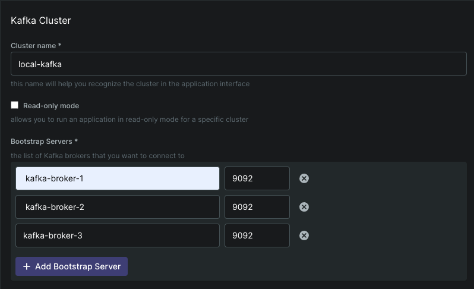

# 실행전 필요한 스택
- docker

# kafka, db 등 시스템 구성요소 실행을 위해 다음 명령어를 실행해주세요. (다 올라갈때까지 30초정도 기다려주세요.)
```shell
cd <projectRoot>/food-ordering-system-container
make up
```

# 종료
```
cd <projectRoot>/food-ordering-system-container
make down
```


# kafka-ui 클러스터 설정

