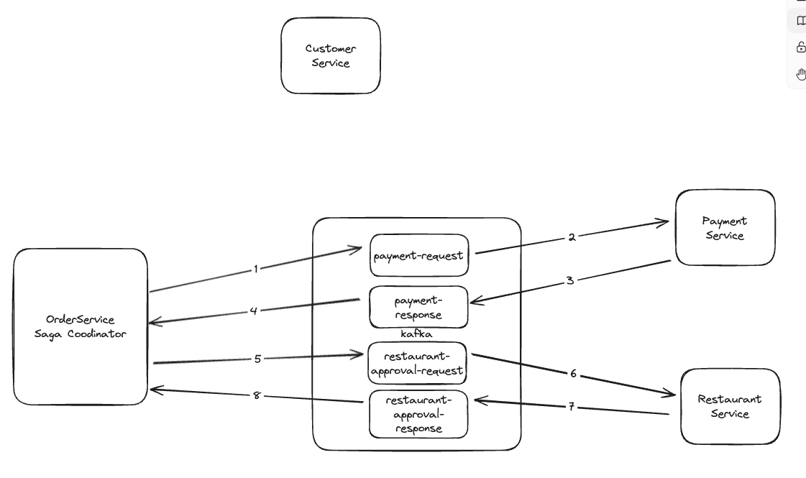

# **프로젝트 소개**

MSA 환경에서 분산 트랜잭션 프로세스를 구현한 프로젝트입니다. 주문 서비스, 결제 서비스, 식당 서비스가 각각 독립된 서버에서 운영되는 이 시스템은 주문 서비스에서 시작하여 결제 서비스, 식당 서비스가 각각 통신하며 요청을 처리하는 예시를 구성했습니다.

# 시스템 구조와 아키텍처에 대한 접근

프로젝트에서는 Long Transaction 처리와 트랜잭션 및 이벤트 처리의 원자성을 보장하는 방법에 대한 해결책을 모색했습니다. 또한, 헥사고날 아키텍처를 도입하여, 확장성과 유지보수성이 뛰어난 시스템을 설계하였습니다. 헥사고날 아키텍처는 핵심 비즈니스 로직과 인프라스트럭처의 결합도를 최소화하며, 다양한 외부 인터페이스와의 상호작용을 유연하게 관리할 수 있도록 구성했습니다.

# 프로젝트 기술스택
Java/Spring 기반의 멀티모듈 프로젝트로 구성했습니다. DB는 postgresql를 사용했으며,

이벤트 통신은 kafka, API간 통신은 feign을 이용했습니다.

로컬 개발 구성 및 테스트를 위해 flyway를 구성했습니다.
# 프로젝트 구조

order-service, customer-service, payment-service, restaurant-service는 헥사고날 아키텍처를 기반으로 DDD(도메인 주도 설계) 개발 방법론을 적용했습니다.

mutation과 query 모두 web adapter를 통해 command로 application에 전달되며, command handler로 처리하도록 구성했습니다. query의 경우에는 mutation보다 훨씬 간단하지만, 일관된 구조가 팀에 더 도움이 된다 생각하여 구성했습니다.

ORM엔티티와 도메인엔티티를 분리하였고, DataMapper를 통해 변환하도록 구성했습니다. 외부로 나가는 데이터의 경우에는 MessageMapper, DataAccessMapper를 구성하여 도메인 엔티티와 외부 메시지, 응답 메시지에 대한 데이터 의존성을 분리했습니다. ORM엔티티와 도메인엔티티를 분리하게된 이유는 도메인 서비스의 테스트를 더 다양하게 하기 위함이고, 많은 테스트를 실행시 의존성이 적을 수록 테스트를 구성하기도 편리하다 생각하여 분리했습니다. 또한, 운영 환경과 비슷한 상황에서 테스트할 수 있도록 testContainer를 통한 통합 테스트 환경도 구성했습니다.

## 각 서비스 상세 설명

- module-common
  - 프로젝트 전반에서 사용하는 Enum, 값객체, 마커인터페이스, 모듈들이 포함되어있고, 각 서비스 모듈에서 주입받아서 사용합니다.
    - 값객체를 통해 value대신 컨텍스트를 담을 수 있게 구성했습니다.
    - Aggregate라는 마커인터페이스를 통해 해당 엔티티가 애그리거트 루트인지 그냥 엔티티인지 구분했습니다.
- order-service
  - 주문 서비스 객체이며, 주문 사가에 대한 쿠디네이터역할을 합니다. 사가는 코레오그라피유형이며 쿠디네이터를 두는 하이브리드 구조로 구성했습니다.
  - 사가 구성도

  - 주문에 필요한 restaurant, customer정보는 feign을 통해 restaurant와 customer 서비스와 통신합니다.
  - 트랜잭션과 event발행의 원자적 구성을 위해 outbox 패턴을 사용했습니다. POC 목적이기 때문에 스케쥴러를 이용했으며, order-service, payment-service, restaurant-service에서 각각 사용되며, 낙관적 락과 unique 제약을 통해 outbox 중복 처리를 보완을 했습니다.
  - 스케쥴러를 통해 outbox 테이블을 조회합니다.
    - 동시성 이슈가 발생할 수 있기 때문에 낙관적 락을 구현했습니다.
    - sagaid와 status를 통해 unique제약 조건으로 이중으로 같은 row생성되지 않도록 처리했습니다.
  - 스케쥴러에 대안으로 CDC를 구성할수 있으나, outbox 패턴을 깊게 파악하고자 스케쥴러를 이용했습니다.
- customer-service
  - 간단한 고객정보를 조회하는 API를 제공하며, 도메인 서비스 내에서 사용하는 repository와 view에 특화된 repository를 구분했습니다. queryDSL를 통해 검색 로직을 type-safe하게 구성했습니다.
- payment-service
  - saga를 구성하기 위해 넣었고, 간단히 주문생성에 대한 Event를 컨슈밍하며, 결제 Event를 퍼블리시 하는 역할을 합니다.
- restaurant-service
  - saga를 구성하기 위해 넣었고, 주문한 가격, 상품가격, 가게의 오픈상태를 검증하고 주문 승인 요청 Event를 컨슈밍하며 주문 승인 허용 Event를 퍼블리시합니다.

# 개발 환경

- Mac 14.1.2
- Docker version 24.0.6

# 인프라 세팅

kafka, db 등 시스템 구성요소 실행을 위해 다음 명령어를 실행해주세요. (다 올라갈때까지 30초정도 기다려주세요.)

```bash
$cd <projectRoot>
$ ./startup.sh
```

# 프로젝트 실행방법

```jsx
컨테이너들이 다 정상으로 올라갔다면, 각 서비스를 모두 띄워야합니다

customer-service
order-service
payment-service
restaurant-service
```

# API 문서

POSTMAN: https://documenter.getpostman.com/view/16117014/2s9YsJBCTb